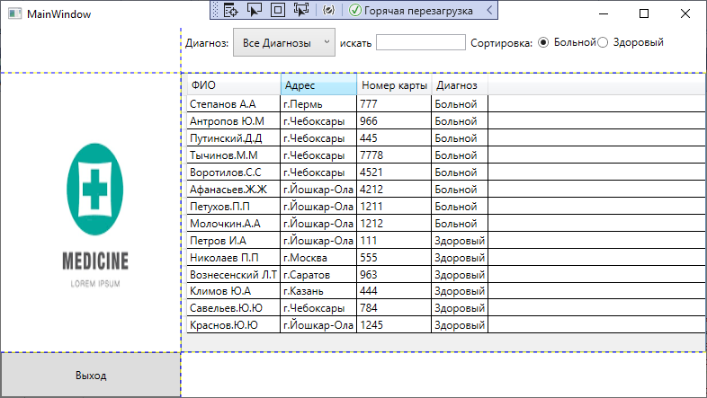

# Лабораторная работа
<table style="width: 100%;">
  <tr>
    <td style="text-align: center; border: none;">
    Министерство образования и науки РФ 
Государственное бюджетное профессиональное образовательное учреждение Республики Марий Эл 
Йошкар-Олинский технологический колледж
</td>
  </tr>
  <tr>
    <td style="text-align: center; border: none; height: 15em;">
    <h2 style="font-size:3em;">Отчет</h2>
      <h3>по лабораторной работе   по дисциплине "Основы алгоритмизации и программирования"   Тема:<b> "Регулярные выражения"<b> </h3></td>
  </tr>
  <tr>
      <td style="text-align: right; border: none; height: 20em;">
      Разработал: 
      Группа: И-21 
      Преподаватель: 
      Колесников Евгений Иванович
    </td>
  </tr>
  <tr>
    <td style="text-align: center; border: none; height: 5em;">
    г.Йошкар-Ола,  2021</td>
  </tr>
</table>

 

  Вывод:Научился разрабатывать WPF-приложение,поиск,сортировку,фильтрацию по словарю.
